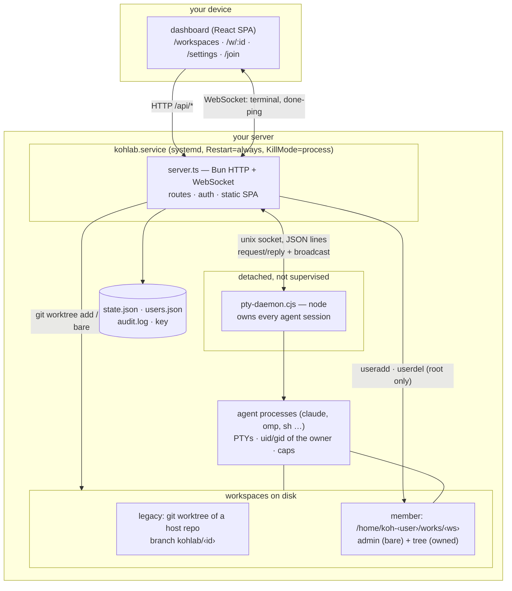
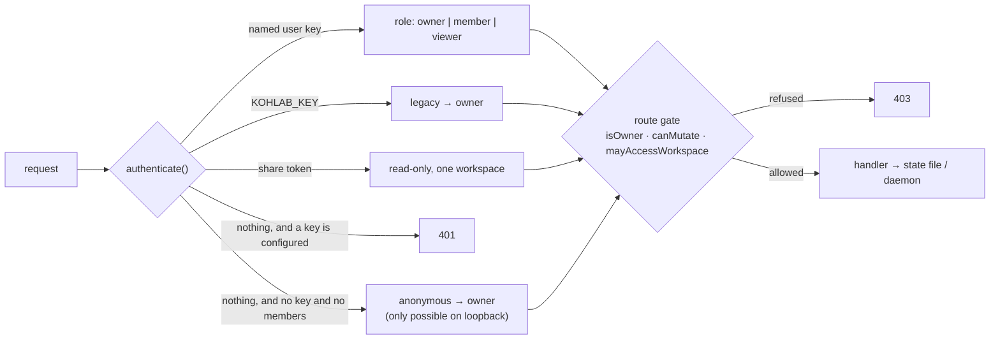
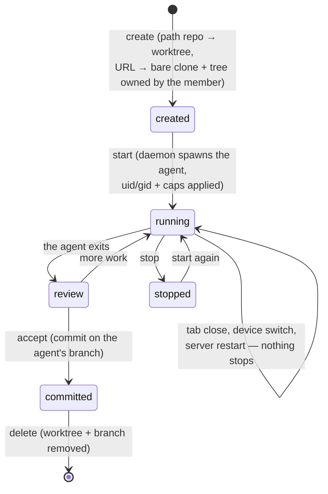
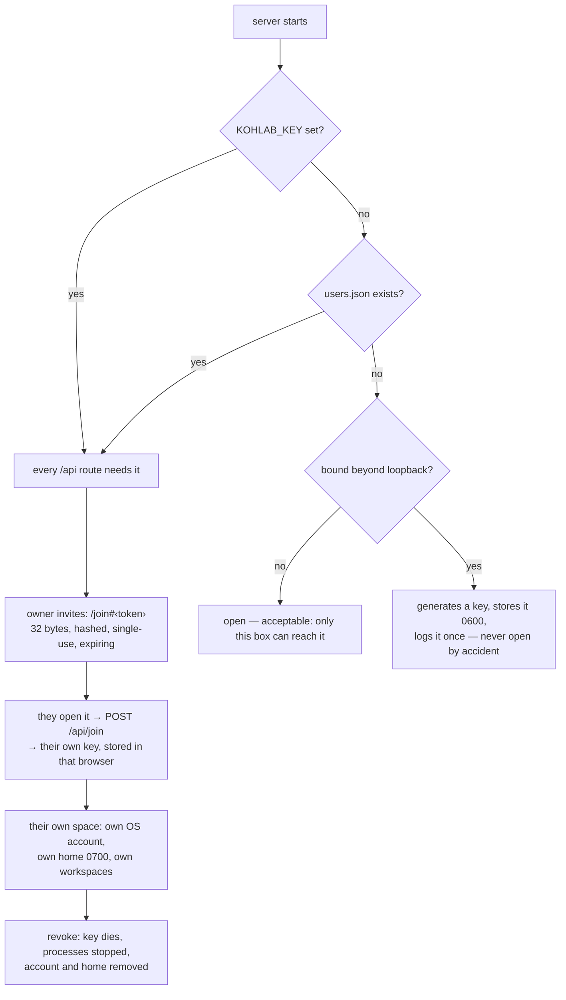

# Architecture

Kohlab is three processes and four files on one box. Everything here is meant to
be read before changing the shape of it.

## The shape

Two properties to protect when changing this:

- **The daemon is detached on purpose.** It outlives the server, so a restart, an
  update, or a crash does not end a single agent session. `KillMode=process` in
  the unit is what stops systemd signalling the whole cgroup and taking the daemon
  with it. The cost is that nothing supervises the daemon: if it dies, every
  session dies with it and no one is told.
- **The server is replaceable; the daemon is not.** Anything the server holds in
  memory may vanish at any moment, which is why the over-the-air update writes its
  progress to `$WORKS_DIR/update.log` rather than keeping it in a variable.

## The request path, and the one place authorization happens

**No handler checks a role itself.** The route table is the single place
authorization happens, so a route that forgets its gate is simply open — which is
exactly how `POST /api/users` shipped with no check at all, in a table where the
two routes beside it both had one. The check suite now walks every mutating route
as a viewer and as an anonymous caller for that reason. If you add a route, add it
to that list in the same commit.

## A workspace's life

The gate is a *branch*, not a lock: the agent owns its worktree and can run any
git command inside it. What it cannot do is change the branch your checkout has
checked out. Bringing a committed workspace into your own branch is still a manual
merge, and that last mile is on the roadmap.

## Who can reach it, and how someone joins

## Where the design is thin

Not gaps in features — gaps in *shape*. Each has a smallest fix.

| Seam | Why it is thin | Smallest fix |
| --- | --- | --- |
| **Supervision** | The daemon is deliberately unsupervised, so its death is silent and total | A liveness beat the server can read, plus a systemd unit for the daemon with `Restart=on-failure` — sessions would still be lost, but you would *know* |
| **Storage** | One JSON file, re-read and re-parsed on every call. Fine at 400 bytes, wrong shape at scale, and there is no seam to change it | Keep the file; put every read behind one cached accessor so a move to SQLite is one file, not every call site |
| **Authorization** | All of it lives in one switch, by convention | One `gate(roleOk)` helper returning 401-not-authenticated or 403-wrong-role, so "refused" is structural and the ten routes that answer 403 for no credentials become uniform with it |
| **Events** | Completion is a 2-second poll; session death has no path to the user at all | One outbound event seam (the push channel already exists) that both completion and death go through |
| **The owner's own tenancy** | A member is isolated by uid; the *owner* is the server user, which is root on a default install | The installer's unprivileged service user (in the plan), so "every agent runs as someone, never root" is true for the first person too |

## What the seams became

Each of the thin seams above now has its smallest fix attached, or a check that
measures it:

- **Supervision** — a liveness probe (`GET /api/health`, `kohlab health`), the
  daemon's death pushed to every open dashboard the moment its socket closes, the
  death recorded in the audit trail, and `lastDaemonDeath` reported even after a
  probe has brought a new daemon up. Still no supervisor: the daemon is not
  restarted by systemd, only by the next operation that needs it.
- **Storage** — `schemaVersion`, with a file from a newer build refused rather
  than half-read, and a versionless file loaded, stamped and kept. Single JSON
  file still; the read path is the seam to change when it stops being enough.
- **Authorization** — one `gate()` predicate, so 401 precedes 403 structurally
  instead of by convention, plus a throttle on the auth path.
- **Events** — one outbound path: completion and daemon death both go through the
  push channel and the audit trail.
- **Evidence** — 18 checks, including a static accessibility scan that verifies
  itself, performance budgets, and a backup/restore round trip.

## What the roadmap still adds to this picture

- **Standalone terminals**: a session that belongs to a *person* rather than a
  repository, several at once, with names. The daemon needs no change — it takes
  an id, a cwd and a command, and does not care what the id means — so this is a
  model and UI change in the server and the dashboard.
- **A supervisor for the daemon** with `Restart=on-failure`, so a death is
  repaired rather than merely reported.
- **A browser-based accessibility audit** (`axe-core` against the real DOM). The
  current scan is a source scan and says so; see docs/accessibility.md.
